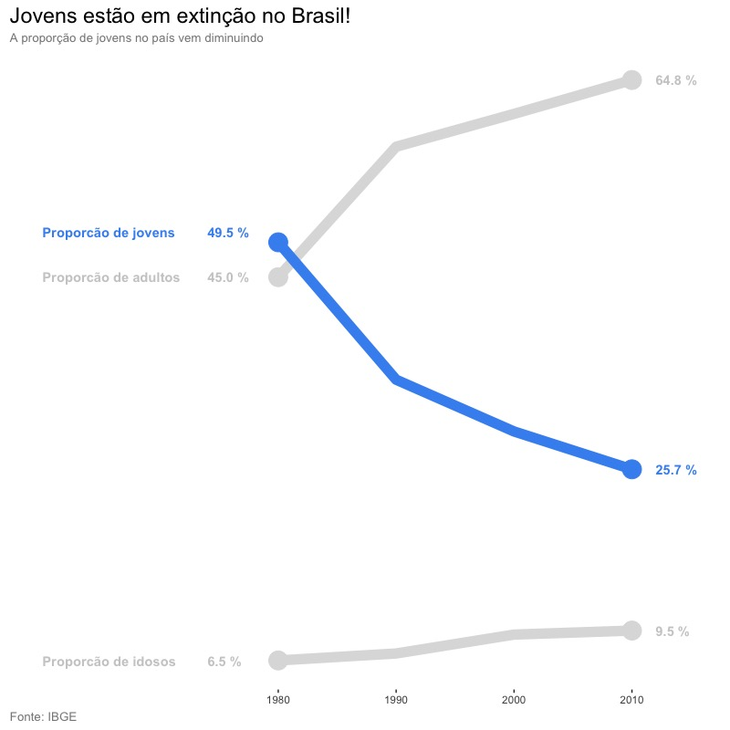
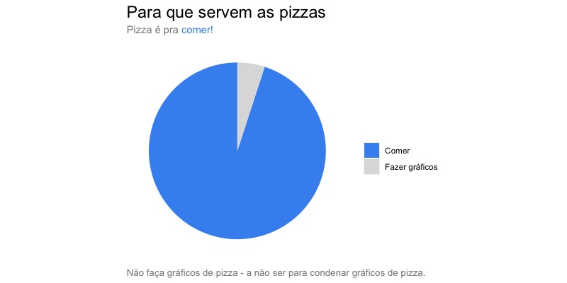
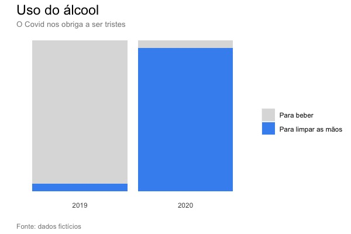
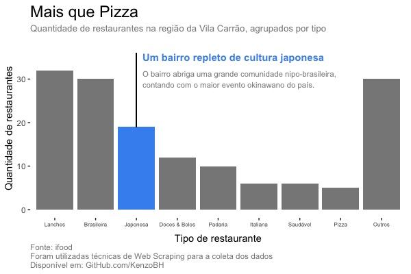
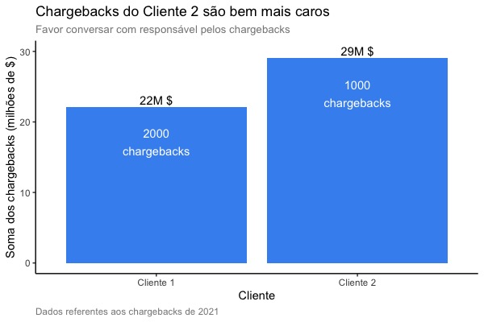

# Visualizations
Repo that contains nice data visualizations.  
this repository is intended to contain beautiful data visualizations, which I do to develop my skills.  
The plots shown here are made in R and in Python, using:

- R: ggplot2 (which I prefer over Python :p)
- Python: matplotlib, seaborn

There are two folders here: [Visualizations](Visualizations) - that contains the image files -, and [Scripts](Scripts) - that contains the .R and .py files that I used to generate the plots.

---

**Plot 06**  
About Brazil population over the last years

  

**Plot 05**  
About pie charts

  

**Plot 04**  
Alcohol consumption after covid - sample data.

  

**Plot 03**  
Restaurants at Vila Carrão, japanese neighborhood - scraped data from ifood website.

  

**Plot 02**  
Company chargebacks grouped by clients - sample data.

  

**Plot 01**  
Revenue predictions plot - sample data.

  

